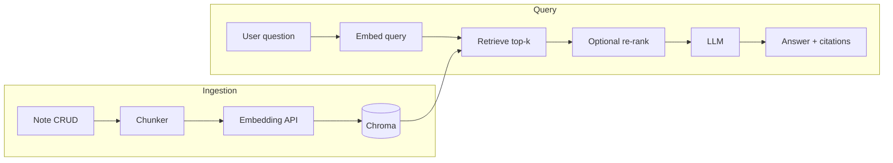

# RAG over notes — implementation roadmap

This document outlines how to ship **query-your-own-notes** using retrieval-augmented generation (RAG), including ingestion, retrieval, generation, freshness, and security. The RAG pipeline is implemented with **LangChain.js** (TypeScript) on the Next.js server.

---

## Goals and success criteria

- **User goal**: Ask natural-language questions and get answers grounded in the user’s notes (with traceability to sources).
- **Product criteria**: Low latency for typical queries, correct handling of edits and deletes, no leakage across users or unauthorized notebooks.
- **Engineering criteria**: Observable pipeline (logs/metrics), repeatable evaluation on sample questions, and a path to improve retrieval without rewriting the whole stack.

---

## Architecture overview

1. **Ingestion**: When note content changes, LangChain text splitters chunk the note → OpenAI embeddings → upsert into Chroma (and remove stale rows on delete).
2. **Query**: LangChain retrieval (embed question, Chroma similarity search with metadata filters) → optional re-ranking → prompt + `gpt-4o-mini` → answer + citations.
3. **Governance**: Every retrieval path enforces the same authorization rules as the rest of the app (filters applied in app code / retriever config, not left to defaults).

---

## Phase 0 — Foundations (before code paths multiply)

### Model decisions (v1)

| Role | Model | Notes |
|------|--------|--------|
| **Embeddings** | `text-embedding-3-small` | Default **1536** dimensions; use the same model and dimensions for ingest and query. Changing models implies re-embedding all chunks. |
| **Chat / answers** | `gpt-4o-mini` | Assembles the final answer from retrieved context; swappable without re-embedding the index. |

Both via **OpenAI API**. Note text is sent to OpenAI for embedding and for answer generation.

### Vector store decision (v1)

| Item | Choice |
|------|--------|
| **Store** | **Chroma** — vectors + metadata live outside Postgres; notes remain the source of truth in the existing DB. |
| **Collections** | One collection per **environment** (e.g. `nevernote-dev`, `nevernote-prod`); scope retrieval with metadata, not per-user collections. |
| **Chunk identity** | Stable id per chunk, e.g. `{noteId}:{chunkIndex}` — supports idempotent upserts and delete-by-note. |
| **Metadata (required)** | `userId`, `noteId`, `chunkIndex`, `title`, `notebookId` (see **Metadata schema** below). Optional later: `contentHash`, `updatedAt`. |
| **Text embedded** | **Title + body** — prepend note title to content before chunking so every chunk’s vector includes title context. |
| **Chunk text for citations** | Store excerpt (or full chunk text) in Chroma **metadata** or `document` field so query responses need not always load `Note.content`. |
| **Auth at query time** | Every similarity search includes a **mandatory** `userId` filter (from session); never trust client-supplied user id alone. |
| **Deletes** | On note delete, remove all Chroma entries for that `noteId` (in addition to Postgres). |
| **Deployment** | **Dev:** Chroma via **Docker** (document compose service + connection URL in README). **Prod:** TBD (dedicated Chroma server or single-host pattern). |

Postgres + Prisma unchanged for users, notebooks, and notes. Revisit **pgvector** only if operating two stores becomes painful (e.g. strong need for transactional note+vector updates or hybrid search entirely in SQL).

### LangChain.js (v1)

Use **LangChain.js** in server-side API routes / libs (not in the browser) to wire chunking, embeddings, vector store, and the Q&A chain. Prisma remains responsible for note CRUD; LangChain owns the RAG path into Chroma.

| Area | LangChain building blocks (indicative) |
|------|----------------------------------------|
| **Chunking** | `RecursiveCharacterTextSplitter` with **`chunkSize: 1000`**, **`chunkOverlap: 200`** (characters; matches LangChain defaults but set explicitly in code). Markdown-aware splits later (Phase 4). |
| **Embeddings** | `OpenAIEmbeddings` with `text-embedding-3-small` (1536 dimensions). |
| **Vector store** | `Chroma` vector store integration; collection per environment; metadata: `userId`, `noteId`, `chunkIndex`, `title`, `notebookId`. |
| **Retrieval** | Vector store retriever with **mandatory** metadata filter for `userId`; tune `k` for context budget. |
| **Generation** | `ChatOpenAI` (`gpt-4o-mini`) via an LCEL chain or retrieval QA pattern; system prompt enforces cite-only-from-context and uncertainty. |

**Packages (add during Phase 1):** e.g. `langchain`, `@langchain/core`, `@langchain/openai`, `@langchain/community` (Chroma), plus a Chroma client as required by that integration.

**Keep in application code:** session auth, when to trigger ingest/delete, mapping chunk ids (`{noteId}:{chunkIndex}`), and API response shape (`answer`, `sources[]`). Do not rely on LangChain defaults for multi-tenant isolation.

### Chunking decision (v1)

| Parameter | Value | Notes |
|-----------|--------|--------|
| **Splitter** | `RecursiveCharacterTextSplitter` | Separators `["\n\n", "\n", " ", ""]` unless overridden later. |
| **chunkSize** | **1000** | Measured in **characters** (LangChain default `lengthFunction`). |
| **chunkOverlap** | **200** | ~20% overlap; tune in Phase 4 if boundary retrieval misses show up in eval. |
| **Text for embedding** | **Title + body** | Before split, build one string (e.g. `Title: {title}\n\n{content}`) so embeddings and chunks carry the note title. |

### Metadata schema (v1)

Stored on **every** Chroma document (LangChain `Document.metadata`):

| Field | Purpose |
|-------|---------|
| `userId` | Mandatory filter at retrieval (session user only). |
| `noteId` | Citations, delete-by-note, upsert identity with `chunkIndex`. |
| `chunkIndex` | Stable ordering; part of chunk id `{noteId}:{chunkIndex}`. |
| `title` | Citation display and filtering/debugging without a DB round-trip. |
| `notebookId` | Notebook context for citations; future notebook-scoped filters. |

Chunk **content** (for embedding and citations) still lives in the document `pageContent` / Chroma document body (split from title+body). Do not rely on metadata alone for answer context.

| Item | Notes |
|------|--------|
| **RAG implementation library** | **Decided:** LangChain.js (see table above). |
| **Embedding model choice** | **Decided:** `text-embedding-3-small` (see table above). |
| **Chat model choice** | **Decided:** `gpt-4o-mini` (see table above). |
| **Vector store choice** | **Decided:** Chroma (see table above). |
| **Chunking strategy** | **Decided:** `RecursiveCharacterTextSplitter`, **1000** / **200** chars (see table above). Evolve to **markdown-aware** splits (Phase 4) once baseline works. |
| **Metadata schema** | **Decided:** `userId`, `noteId`, `chunkIndex`, `title`, `notebookId` (see table above). |
| **Privacy / data residency** | Note text goes to **OpenAI** for embeddings and answers; chunk text/snippets are also stored in **Chroma** (local or your deployment). Document for yourself or end users. |

**Exit criteria**: Written ADR or short decision record for store + embedding model + providers. **Done:** LangChain.js, OpenAI models, Chroma, chunking (1000 / 200), metadata schema, title+body embedding.

---

## Phase 1 — Minimal vertical slice (end-to-end RAG)

### Phase 1 slice decisions

| Topic | Decision |
|-------|----------|
| **Chroma (dev)** | Run via **Docker**; app connects to the container (host/port in env). |
| **Ingestion trigger** | Call ingest helper from existing note **create** and **update** API routes (`POST` / `PATCH` on notes), synchronously for v1. |
| **Existing notes** | **No backfill** in Phase 1 — only notes **created or updated after** RAG ships are indexed. Phase 3.3 backfill remains optional later. |
| **Deletes** | **In Phase 1:** on note **delete** API route, remove all Chroma chunks for that `noteId` (same as roadmap delete behavior, not deferred). |
| **Query responses** | **Non-streaming** — query API returns complete JSON (`answer` + `sources[]`). Streaming deferred. |
| **Chat UI** | **Global panel** (app-wide), not notebook-scoped for v1. |
| **Text embedded** | **Title + body** (prepend title before chunking). |
| **Chunk metadata** | `userId`, `noteId`, `chunkIndex`, `title`, `notebookId` on every document. |

### Implementation steps

| Step | Description |
|------|-------------|
| **1.0 Dev infra** | Add Docker Compose (or equivalent) for Chroma; wire `CHROMA_*` (or similar) env vars for local dev. |
| **1.1 Chunking module** | Build **title + body** string, then `RecursiveCharacterTextSplitter({ chunkSize: 1000, chunkOverlap: 200 })` → `Document`s with metadata `userId`, `noteId`, `chunkIndex`, `title`, `notebookId`. Log chunk counts and average size in dev. |
| **1.2 Embedding + store** | `OpenAIEmbeddings` + Chroma via LangChain (Docker in dev); embed `pageContent` from title+body chunks; stable ids `{noteId}:{chunkIndex}`; persist metadata fields above. |
| **1.3 Ingestion helper** | Server module: given a note (title, body, `notebookId`, `userId`), delete prior Chroma docs for that `noteId`, re-split title+body, re-embed, upsert. |
| **1.4 Ingestion + delete triggers** | **Create/update:** existing `app/api/notes` routes call ingestion helper after successful Prisma write. **Delete:** existing note delete route removes all Chroma entries for that `noteId`. |
| **1.5 Query API** | Single endpoint: LangChain retriever + `ChatOpenAI` chain; `userId` filter on retrieval; **non-streaming** JSON with `answer` + `sources[]` (note id, title from metadata, notebookId, chunk excerpt). |
| **1.6 UI** | **Global** chat panel; submit question, show answer and citations that open the note. |

**Exit criteria**: Manually verify on **new or edited** notes (post-launch): correct note surfaces, edits reflect after re-ingestion, **delete** removes content from answers, empty retrieval yields a safe “I don’t know from your notes” style response. Pre-existing unindexed notes are expected to be invisible to RAG until backfill (Phase 3.3).

---

## Phase 2 — Authorization and multi-tenant safety

| Step | Description |
|------|-------------|
| **2.1 Filtered retrieval** | Every Chroma query includes **mandatory** metadata `where` (e.g. `userId` = session user). Never rely on post-filtering alone. |
| **2.2 Notebook / sharing rules** | If the app has sharing later, align metadata with your permission model early (even if unused). |
| **2.3 Audit / logging** | Log query id, latency, chunk ids retrieved; avoid logging full note bodies in production logs unless necessary. |

**Exit criteria**: Threat-model pass: a user cannot retrieve another user’s chunks by tampering with client-side parameters.

---

## Phase 3 — Freshness, deletes, and operational correctness

| Step | Description |
|------|-------------|
| **3.1 Deletes** | **Baseline in Phase 1** (note delete → Chroma cleanup). Phase 3 extends hardening (failure handling, verification, edge cases). |
| **3.2 Idempotent upserts** | Re-running ingestion for the same content should not duplicate chunks; use deterministic chunk ids or delete-then-insert per note. |
| **3.3 Backfill job** | One-shot script or admin route to index **pre-existing** notes for a user (rate-limited, resumable). Not required for Phase 1 slice. |
| **3.4 Stale detection (optional)** | Store `contentHash` per note; skip embed if unchanged. |
| **3.5 Async processing (optional)** | Move heavy work off the request path (queue + worker) once volume or latency demands it. |

**Exit criteria**: Edit → query shows new facts; delete → old content never appears in answers.

---

## Phase 4 — Retrieval quality

| Step | Description |
|------|-------------|
| **4.1 Markdown-aware chunking** | Custom or LangChain markdown header splitter; prefer splits on headings and paragraphs; preserve code blocks as single chunks where possible. |
| **4.2 Hybrid search** | Combine Postgres full-text (notes table) with Chroma vector search if “exact phrase” queries are common; merge/rank in application code. |
| **4.3 Re-ranking** | Retrieve larger `k`, then re-rank with a cross-encoder or a lightweight model; trim to final context budget. |
| **4.4 Query rewriting (optional)** | Step-back or multi-query expansion for vague questions; keep behind a flag at first. |
| **4.5 Prompting and citations** | System instructions: only use provided context, cite note titles/ids, admit uncertainty. Cap context tokens. |

**Exit criteria**: Small **eval set** (10–30 real questions with expected note ids); measure recall@k and qualitative answer quality over time.

---

## Phase 5 — Product hardening

| Step | Description |
|------|-------------|
| **5.1 Rate limits and quotas** | Per-user caps on queries and embedding volume. |
| **5.2 Cost controls** | Cache embeddings for unchanged chunks; monitor token usage for LLM calls. |
| **5.3 Observability** | Traces for ingest vs query; dashboards for error rate, p95 latency, empty-retrieval rate. |
| **5.4 User controls** | Opt-in, “clear my index,” or per-notebook exclusion if needed. |

---

## Suggested implementation order (summary)

1. Phase 0 decisions (LangChain.js, Chroma, chunking 1000/200, metadata; models: `text-embedding-3-small`, `gpt-4o-mini`).
2. Phase 1 vertical slice (LangChain split → embed → Chroma → retrieve → answer).
3. Phase 2 auth on retrieval (non-negotiable before any wider rollout).
4. Phase 3 backfill, idempotency hardening, async ingest (deletes already in Phase 1).
5. Phase 4 quality iterations (chunking, hybrid, re-rank, eval).
6. Phase 5 hardening (limits, cost, observability, user controls).

---

## Open questions to resolve during Phase 0

- ~~**Streaming vs non-streaming** answers in the UI?~~ — **Resolved (Phase 1):** non-streaming JSON first.
- ~~**Self-hosted vs API** for embeddings and LLM~~ — **Resolved:** OpenAI API (`text-embedding-3-small`, `gpt-4o-mini`).
- ~~**Single global index** per environment vs per-user collections~~ — **Resolved:** one Chroma collection per environment; filter by `userId` metadata.
- ~~**Chroma dev deployment**~~ — **Resolved:** Docker.
- ~~**Ingestion scope for slice**~~ — **Resolved:** create/update API hooks only; no backfill until Phase 3.3.
- ~~**Chat UI placement (slice)**~~ — **Resolved:** global panel.
- ~~Whether **notebook-level** or **note-level** metadata is sufficient~~ — **Resolved:** store `noteId` + `notebookId` (+ `userId` filter); notebook-scoped retrieval optional later.

---

## References (for later deep dives)

- RAG failure modes: stale index, wrong chunk boundaries, over-trust of LLM, missing filters.
- Evaluation: golden questions + manual rubric before investing in automated metrics.
